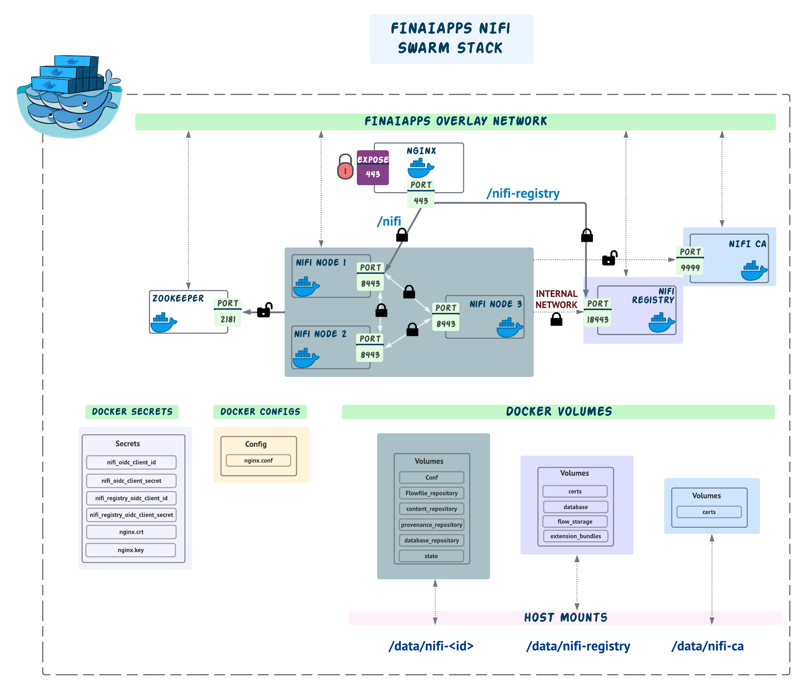

# FinAIApps NiFi Stack
A production-ready fullstack deployment of FinAIApps NiFi ecosystem. 

## Stack overview

* Zookeeper
* NiFi Node 1, 2 & 3
* NiFi Certificate Authority (CA)
* NiFi Registry
* Nginx

## Prerequisites
* Install [Docker](https://www.docker.com/)
* Install [Docker Compose](https://docs.docker.com/compose/install/)

## Design


## Docker Builds
All Docker images are pulled from Docker hub registry with an exception of NiFi, NiFi Registry and NiFi Ceritificate Authority (CA) images which are built from [this](https://github.com/Fin-AXS/nifi-docker-build) repository.

## Deploy NiFi Stack
Before you deploy the stack, ensure you have pointed to pre build nifi, nifi-registry and nifi-ca docker images.

### Usage (Development)
To try this stack out-of-the-box, you need a local `.env` where environment variables are specified which will be available to containers

```bash
# Pre-install changes, this will perform necessary instructions to run our compose services 
$ ./compose-run.sh
# Start the Docker Compose service
$ docker-compose up
```

```bash
# Check if all containers are up and running
$ docker ps
```

### Usage (Production)
For Production, you must leverage docker swarm mode which orchestrate and manages the stack. To try this stack, simply run

```bash
# Pre-install changes, this will perform necessary instructions to run our swarm services such as creating secrets
$ ./swarm-run.sh
# Start the Docker Swarm service
$ docker stack deploy -c docker-swarm.yml nifi-stack
```

```bash
# Check if all services are up and running
$ docker service ls
ID             NAME                       MODE         REPLICAS   IMAGE                    PORTS
etmg9i3qyg6e   nifi-stack_init-service    replicated   0/1        busybox:latest
dy6s35phq4ob   nifi-stack_nginx           replicated   0/1        nginx:1.21.6             *:80->80/tcp, *:443->443/tcp
skp7115ieyv7   nifi-stack_nifi-1          replicated   0/1        custom-nifi:latest       *:30003->8443/tcp
khc1esyq8e82   nifi-stack_nifi-2          replicated   0/1        custom-nifi:latest       *:30004->8443/tcp
xo7q54hrv1ug   nifi-stack_nifi-3          replicated   0/1        custom-nifi:latest       *:30000->8443/tcp
wbnaw5nm4f0h   nifi-stack_nifi-ca         replicated   1/1        custom-toolkit:latest    *:30001->9999/tcp
sa3c6egb8lzo   nifi-stack_nifi-registry   replicated   0/1        custom-registry:latest   *:18443->18443/tcp
6egm2pz8cbcg   nifi-stack_zookeeper       replicated   1/1        zookeeper:3.6.2          *:30002->2181/tcp
```

```bash
# docker secrets
$ docker secret ls
ID                          NAME                               DRIVER    CREATED          UPDATED
mq59y5te157ga900l58g1kiu2   nginx.crt                                    22 seconds ago   22 seconds ago
m8lpsi2iw0femvwrxl1pbavhv   nginx.key                                    22 seconds ago   22 seconds ago
yl3ituc47by9k7ui3r2sjfgq8   nifi_oidc_client_id                          22 seconds ago   22 seconds ago
boz3wl2xqf1xo7w4syxglxlgy   nifi_oidc_client_secret                      21 seconds ago   21 seconds ago
a2cwu50qt0mih6iu2bnr5wbhz   nifi_registry_oidc_client_id                 21 seconds ago   21 seconds ago
v9uiupir3e9lofe1yp8mfohv8   nifi_registry_oidc_client_secret             21 seconds ago   21 seconds ago
```

```bash
# docker configs
$ docker config ls
ID                          NAME                    CREATED              UPDATED
q6qwf5edclonlety3z1vz65oo   nifi-stack_nginx.conf   About a minute ago   About a minute ago
```

After deploying the stack, you should have access to the UI
- NiFi: `https://localhost/nifi/`
- NiFi Registry: `https://localhost/nifi-registry/`


## References

- [How to start using NiFi](https://nifi.apache.org/docs/nifi-docs/html/administration-guide.html#how-to-install-and-start-nifi)
- [How to start using NiFi Registry](https://nifi.apache.org/docs/nifi-registry-docs/html/administration-guide.html#how-to-install-and-start-nifi-registry)